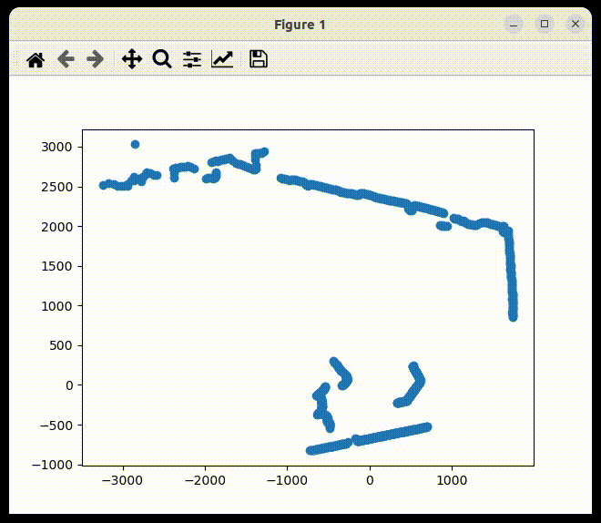

# subsample-ransac
A simple Matplotlib GUI to find lines from a set of selected points

## Dependencies
* Matplotlib
* Numpy

## Usage

```Bash
python main.py --file 3tabla1b.txt --threshold 2 --iter 1000
```
Sample output:

```
slope(m) intersection(c) color(r, g, b, a)
-2.2082043177126587 1280.6157071786006 (1, 0, 0, 0.7)
0.7578175202401215 -560.7716675984672 (0, 1, 0, 0.7)
-0.38520894312170045 470.3789785421974 (1, 0, 1, 0.7)
```

Save output to a text file
```Bash
python main.py --file 3tabla1b.txt --threshold 2 --iter 1000 > output.txt
```


